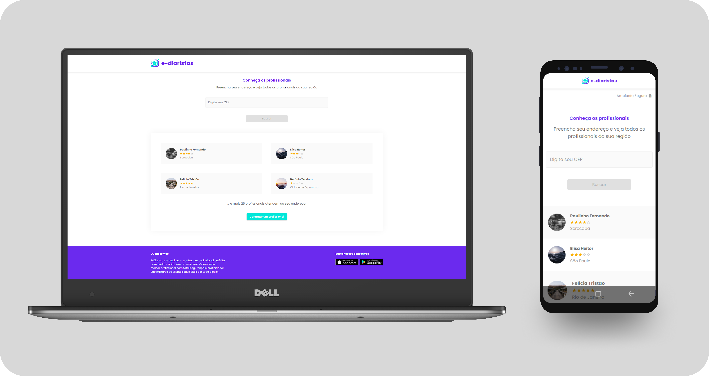
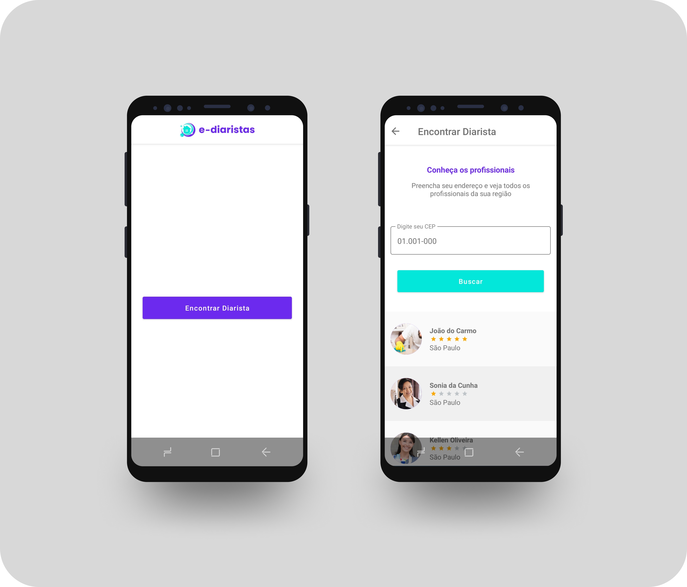

<h1 align="center">
  <div align="left">
    
  </div>

  
  
  <div align="right">
    
  </div>
</h1>


## 📃 O que é MultiStack?

MultiStack é um workshop produzido por [TreinaWeb](https://github.com/treinaweb), uma escola online para desenvolvedores, o objetivo do workshop é produzir uma aplicação full-stack.

### Aulas
- Dia 1: Desenvolvimento Front-end com React e Next.js. 09/06 - :heavy_check_mark:
- Dia 2: Avançando com React e Next.js. 11/06 - :heavy_check_mark:
- Dia 3: Desenvolvimento com Laravel ou Django. 14/06 - :heavy_check_mark:
- Dia 4: Criação de APIs com Laravel ou Django. 15/06 - :heavy_check_mark:
- Dia 5: Desenvolvimento mobile com React Native. 16/06 - :heavy_check_mark:

## 💻 Projeto

E-diaristas é uma aplicação full-stack que foi desenvolvida para oferecer agendamentos de diaristas cadastrados no sistema.

## :rocket: Tecnologias

O projeto está sendo desenvolvido usando:

- [React][reactjs]
- [TypeScript][typescript]
- [Next.JS][nextjs]
- [MaterialUI][materialui]
- [Python][python]
- [Django][django]
- [Expo][expo]

## :information_source: Como usar

Para clonar e usar essa aplicação, você precisará de [Git][git] + [Node.js][nodejs] instalados em sua máquina

```bash
# Clone este repositório
$ git clone https://github.com/VDRBreno/MultiStack1
```

### Instalar Front-end/Web

```bash
# Entre na pasta
$ cd MultiStack1/web

# Instale as dependências
$ npm i

# Iniciar
$ npm run dev

# rodando em localhost:3000
```

### Pré-visualização (front-end)

<h1 align="center">
    
</h1>

### Instalar Back-end/Server (Rota Python/ Django)

```bash
# Você precisa instalar Python e Django na sua máquina antes

# Entre na pasta
$ cd MultiStack1/server/ediaristas

# Iniciar
$ python manage.py runserver

# rodando em localhost:8000
```

### Instalar Mobile

```bash
# Você precisa instalar Expo-cli na sua máquina antes

# Entre na pasta
$ cd MultiStack1/mobile

# Instale as dependências
$ npm i

# Iniciar
$ expo start
```
### Pré-visualização (mobile)

<h1 align="center">
    
</h1>


[typescript]: https://www.typescriptlang.org/
[reactjs]: https://reactjs.org
[nextjs]: https://nextjs.org
[materialui]: https://material-ui.com/pt/
[nodejs]: https://nodejs.org/en/
[git]: https://git-scm.com
[python]: https://www.python.org
[django]: https://www.djangoproject.com
[expo]: https://expo.io